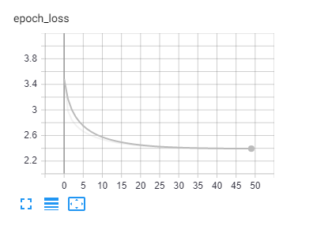
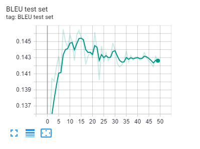
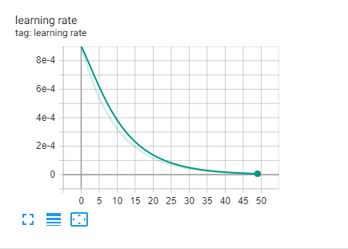

# Imagecaptioning
Deep learning with Tensofflow course
Image-to-sentence generation project using Tensorflow

# Overview
This repository contains basic end to end implementation of the most straight forward technique for image captioning generation. It is fully implemented with Python, Tensorflow and Keras and includes text preprocessing, image preprocessing using transfer learning, model training and testing. Evaluation is performed with BLEU score.

# Transfer learning and pretrained word embeddings
Due to hardware limitations we decided to make use of transfer learning and pretrained word embeddings:
1. We tested several CNN architectures pretrained on ImageNet for extracting image features extraction which are afterwards fed into the RNN(LSTM). We tested *VGG-16*, *Resnet-50* and *InceptionV3* but finally decided to fully utilize InceptionV3 because of the lower number of parameters(which leads to faster image features extraction) and the better accuracy.
2. The implementation is making use of the Glove embeddings trained on Wikipedia. The argument behind that decision is that it is computationally impossible for us to achieve such level of training with regular computers for that short amount of time.

# Datasets:
1. https://www.kaggle.com/hsankesara/flickr-image-dataset
2. https://nlp.stanford.edu/projects/glove/

# Usage instructions:
1. Download Flickr30k image dataset and place it inside *data/flickr30 folder*
2. Download Glove embeddings and place them inside *embeddings* folder. Currently the algorithm uses glove.6B.200d.txt file which encodes every word with 200 dimension vector and contains 400 000 words overall.
3. You can see all the python requirements inside *requirements.txt* file. Execute the following script for proper project setup:
```
python3 -m venv venv
source venv/bin/activate
pip install -r requirements.txt
cd captioning_model
```
4. The actual image captioning implementation is inside the *captioning_model* folder.
5. If you want to train the algorithm just start up the *train.py* file. You can adjust the parameters if you want to. Use the following command while being inside the virtual environment:
```
python train.py
```
6. Evaluation is executed on each epoch and if you start tensorboard with logdir *logs/fit* you will be able to track the included metrics(learning rate, loss and BLEU score).
7. After the training is finished execute the **test.py** file which generates several image captions for images from the test dataset.
8. If you want to generate captions for other images you can use the *predict.py* file. You can specify image paths with the *-images* parameter using paths relative to the current directory. If you specify the *--plot* flag the images will be rendered visually.
```
python predict.py -images <path_to_image1> <path_to_image2> ... [--plot]
```

# Example training
Here you can see some plots from Tensorboard which show 50 epoch training with learning rate decay and BLEU score evaluation:
## Loss

## BLEU score

## Learning rate

